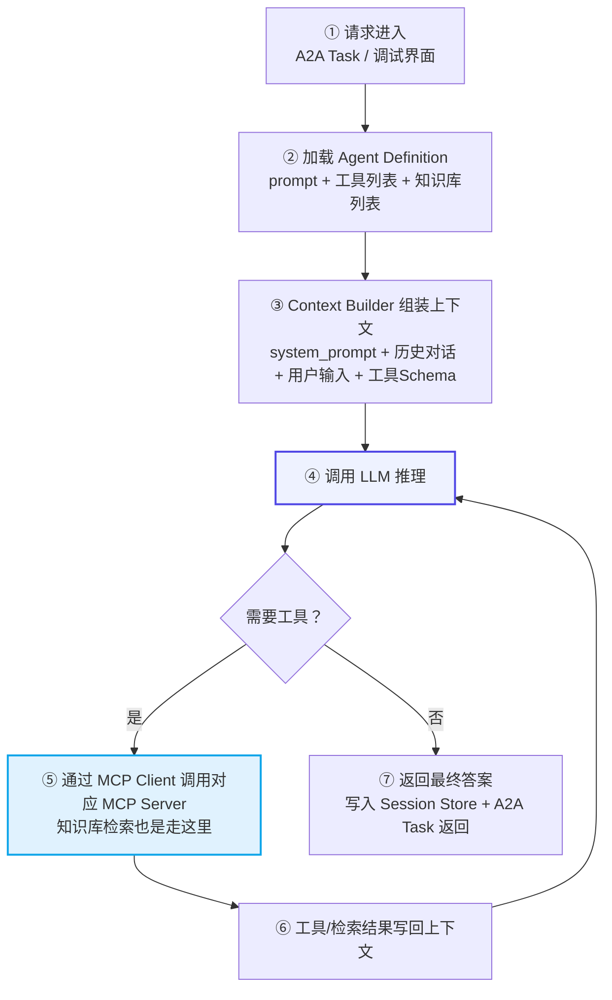

# v2.0.1 设计文档

> 主题：修复 Mermaid 流程图多行节点文字底部被边框裁切、显示不全的问题。

---

## 背景

v2.0.0 上线后，用户在文档中渲染一张纵向业务流程图（`flowchart TB`）时发现：**多个矩形节点内多行文字底部被边框裁切、显示不全**，而单行菱形判断框文字完整。

### 问题复现

触发问题的流程图代码（用户原样提供）：



### 问题特征

| 节点 | 内容 | 表现 |
|------|------|------|
| ② 矩形 | `prompt + 工具列表 + 知识库列表`（多行） | 底部文字被截断 |
| ③ 矩形 | 多行（第二、三行） | 文字下端被框体边缘切掉 |
| ⑤ 蓝色矩形 | 多行（第二行） | 第二行文字明显截断 |
| 其余紫色矩形 | 多行 | 轻微文字底部裁切 |
| ④ 矩形 | 单行短文字 | 完整 |
| 菱形「需要工具？」 | 单行 | 完整 |

**关键观察**：所有多行矩形容器均出现文字下沉、底部内容被边框遮挡；单行文字节点正常。

## 根因分析

v2.0.0 之前 `mermaid.initialize` 仅传 3 个参数（`startOnLoad` / `theme` / `securityLevel`），完全沿用 mermaid 默认值。在富文本编辑器（Milkdown）宿主环境下，三个因素叠加导致多行节点裁切：

### 1. line-height 继承放大（普遍性放大器）

[App.css](file:///workspace/src/App.css#L1-L5) `:root` 设 `line-height: 1.6`，正文段落 1.7。该行高被 CSS 继承机制透传进 mermaid 生成的 `nodeLabel`（HTML 标签，foreignObject 内）。

mermaid 在渲染前用临时 DOM 测量文字尺寸决定 `<rect>` 高度，其内部默认按 `line-height ≈ 1.2` 计算。当实际渲染行高为 1.6 时，**多行文字实际高度约为 mermaid 测量高度的 1.33 倍**（1.6 / 1.2），最后一行溢出 rect 底边被边框遮挡。

单行节点不受行高倍增影响（单行高度差在容差内），故菱形判断框正常。

### 2. 长文本回流触发高度重算偏差（针对性触发）

`flowchart.useMaxWidth` 默认 `true`：节点宽度受容器最大宽度约束，长中文文本发生换行回流。宽度变化触发 mermaid 内部高度重算，测量阶段（固定宽度）与最终布局（回流后宽度）不一致时表现为底部裁切。

本图节点 ②③⑤ 均为长中文 + `<br/>` 强制换行的多行文本，是触发此问题的典型结构；短文本流程图不触发，故"其他流程图正常"。

### 3. 边框加粗侵占内部高度（视觉放大）

节点 D、F 通过 `style stroke-width:2px` 加粗边框。SVG stroke 默认以路径为中线向两侧各延伸 `stroke-width/2` 绘制，加粗边框向内侵占 1px 内部空间，使本就偏紧的节点高度更易暴露裁切。

### 三者关系

- **line-height 继承**是普遍性放大器，让所有多行节点都偏紧（但短文本流程图在容差内未暴露）
- **长文本回流**是这张图的针对性触发器，把偏差放大到肉眼可见
- **边框加粗**进一步侵占内部高度，加剧视觉裁切

## 修复方案

### 1. 提取并完善 Mermaid 配置

[mermaid-view.ts](file:///workspace/src/components/Editor/mermaid-view.ts#L21-L49) 将配置提取为导出的 `MERMAID_CONFIG` 常量，补充 flowchart 子配置与 themeVariables：

```typescript
export const MERMAID_CONFIG = {
  startOnLoad: false,
  theme: "default",
  securityLevel: "strict",
  flowchart: {
    htmlLabels: true,      // 保留 <br/> 多行换行能力
    padding: 20,           // 节点内边距加大（默认 15），给多行文字留呼吸空间
    useMaxWidth: false,    // 不按容器宽度缩放回流，避免高度重算偏差
  },
  themeVariables: {
    fontSize: "14px",      // 锁定字号，避免继承编辑器大字号导致测量与渲染不一致
  },
} as const;
```

| 配置项 | 默认值 | 新值 | 作用 |
|--------|--------|------|------|
| `flowchart.htmlLabels` | true | true | 保留 `<br/>` 多行换行（确认不变） |
| `flowchart.padding` | 15 | 20 | 加大节点内边距，补偿行高与边框侵占 |
| `flowchart.useMaxWidth` | true | false | 关闭容器宽度回流，消除高度重算偏差 |
| `themeVariables.fontSize` | 继承 | 14px | 锁定字号，测量与渲染一致 |

### 2. 锁定 Mermaid 节点标签行高与字体

[App.css](file:///workspace/src/App.css#L619-L633) 新增针对 mermaid 节点标签的样式，**同时作用于测量阶段（临时 `.mermaid` 容器）与最终渲染阶段（`.mermaid-render` 内 SVG）**，使两阶段字体/行高完全一致：

```css
.editor-scroll .milkdown .mermaid .nodeLabel,
.editor-scroll .milkdown .mermaid .edgeLabel,
.editor-scroll .milkdown .mermaid-render .nodeLabel,
.editor-scroll .milkdown .mermaid-render .edgeLabel {
  font-family: -apple-system, BlinkMacSystemFont, "Segoe UI", Roboto,
    "PingFang SC", "Microsoft YaHei", "Noto Sans CJK SC", sans-serif;
  font-size: 14px;
  line-height: 1.25;
}
```

`line-height: 1.25` 接近 mermaid 内部测量假设（~1.2），消除 1.6 倍行高放大；锁定 `font-size: 14px` 与 `font-family` 避免编辑器大字号/字体回退导致测量偏差。

## 测试覆盖

新增 [tests/unit/mermaid-render.test.ts](file:///workspace/tests/unit/mermaid-render.test.ts)（9 个用例），通过 mock mermaid 模块验证配置契约，不引入真实渲染：

| 用例 | 验证点 |
|------|--------|
| `flowchart.htmlLabels` 为 true | 保留 `<br/>` 多行换行能力 |
| `flowchart.padding` >= 18 | 节点内边距足够 |
| `flowchart.useMaxWidth` 为 false | 关闭宽度回流 |
| `themeVariables.fontSize` 已锁定 | 字号不继承编辑器 |
| `createMermaidView` 触发 `mermaid.initialize(MERMAID_CONFIG)` | 配置正确传入 |
| 多次创建 NodeView 不重复初始化 | 懒初始化契约 |
| 渲染含 `<br/>` + `style stroke-width:2px` 多行流程图不抛错 | 用户报告场景回归 |
| SVG 写入 `.mermaid-render` 容器 | 渲染产物落位 |
| `mermaid.render` 收到原始代码（含 `<br/>` 与 style 不被篡改） | 源码透传 |

测试中嵌入了用户报告的原始流程图代码作为回归 fixture，确保该场景永久覆盖。

## 验证结果

- 全套测试通过：**262 个**（v2.0.0 的 253 个 + 本次新增 9 个）
- 不影响其他流程图：padding 加大与字号统一为 14px 对正常流程图无负面影响，是 mermaid 官方推荐的稳定渲染配置

## 文件清单

**修改**：
- [src/components/Editor/mermaid-view.ts](file:///workspace/src/components/Editor/mermaid-view.ts) — 提取 `MERMAID_CONFIG`，补充 flowchart 配置与 themeVariables
- [src/App.css](file:///workspace/src/App.css) — 新增 mermaid 节点标签 line-height/字体锁定
- `package.json` / `src-tauri/tauri.conf.json` / `src-tauri/Cargo.toml` / `src-tauri/Cargo.lock` — 版本号 2.0.0 → 2.0.1

**新增**：
- `docs/v2.0.1 设计文档.md`
- `tests/unit/mermaid-render.test.ts`
