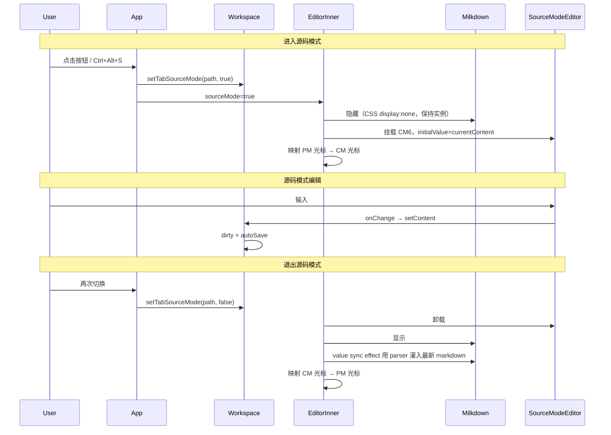

# v2.2.0 设计文档 — 源代码模式（issue #19）

> **目标读者**：能力较弱的 coding agent。请**严格按本文档的任务顺序**逐步实现，每完成一个任务就运行对应测试，**不要跳步、不要自作主张改范围**。
>
> **关联 Issue**：[#19 源代码模式：支持一键切换到原始 Markdown 源码编辑态](https://github.com/zhkp/InklingMD/issues/19)
>
> **版本号**：v2.2.0（单 feature 发版）

---

## 零、开始前必读

### 0.1 这个项目是什么

InklingMD 是一个 **Tauri + React + Milkdown（ProseMirror）** 的本地 Markdown 编辑器。当前编辑体验是 **WYSIWYG**：用户输入 Markdown 语法会立刻渲染成富文本。

本功能要新增 **源代码模式（Source Mode）**：整个编辑区切换为 **CodeMirror 6 纯文本编辑器**，直接编辑原始 Markdown 字符串；再次切换回 WYSIWYG 时，把字符串 re-parse 回 ProseMirror。

### 0.2 核心原则（违反会导致 bug）

1. **Markdown 字符串是唯一可信源**：源码模式下，`workspace` 里的 `content` 字符串就是真相；不要维护第二份独立状态。
2. **整视图切换**：进入源码模式后整个编辑区变为 CM6；**不做**左右分栏预览。
3. **保存链路不变**：源码模式下的编辑仍走 `onChange → setContent → useAutoSave`，落盘仍是 `.md` 纯文本。
4. **不要重建 Milkdown 工厂**：`Editor.tsx` 里 `useEditor(..., [])` 依赖数组为空，编辑器只创建一次；源码模式通过 **条件渲染** 隐藏/显示，而不是改 `useEditor` 依赖。
5. **区分两种「源码模式」**：
   - **本功能**：用户主动切换的可编辑源码模式（issue #19）
   - **已有 fallback**：`Editor.tsx` 469–483 行，Milkdown 初始化失败时的**只读** textarea —— **不要改它的行为**，新功能与之无关

### 0.3 不要做的事（范围外）

- 不做左右分栏「源码 + 预览」
- 不做只读源码查看（必须可编辑）
- 不改 Milkdown 的 remark/serialize 规则（除非 round-trip 测试发现 bug，且需单独说明）
- 不在源码模式实现 ProseMirror 专有功能（表格工具栏、块拖拽、斜杠菜单、大纲同步）
- 不引入新 npm 依赖（CodeMirror 6 和 `@codemirror/lang-markdown` 已在 `package.json`）

### 0.4 开发环境命令

```bash
pnpm install
pnpm test          # 单元/组件测试（Vitest）
pnpm exec playwright test   # E2E（需先 pnpm dev 或由 playwright.config 自动起服）
pnpm build         # 类型检查 + 生产构建
```

---

## 一、需求摘要（来自 issue #19）

| 项 | 要求 |
|----|------|
| 切换入口 | 标题栏按钮 + 快捷键（默认 `Ctrl/Cmd+Alt+S`）+ 快捷键帮助/自定义面板 |
| 编辑区 | 原始 Markdown 纯文本；GFM 语法高亮；行号；主题/字体/缩放与 WYSIWYG 一致 |
| 切换 | 尽量保持光标位置与滚动位置（允许近似映射） |
| 退出 | 源码 re-parse 回 ProseMirror |
| 持久化 | 源码模式开关**按标签页记忆**（切 tab 再切回来应恢复该 tab 的模式） |
| 模式叠加 | 源码模式与专注/打字机模式**互斥**（进入源码模式时自动关闭后两者） |

---

## 二、架构设计

### 2.1 组件层次（切换后）

```
App.tsx
  └─ editor-scroll (style={{ zoom: editorZoom }})
       └─ EditorErrorBoundary
            └─ MarkdownEditor (Editor.tsx)
                 └─ MilkdownProvider
                      └─ EditorInner
                           ├─ [sourceMode=false] <Milkdown />  （WYSIWYG，现有逻辑）
                           └─ [sourceMode=true]  <SourceModeEditor /> （新增，CM6）
```

### 2.2 数据流



### 2.3 为什么隐藏 Milkdown 而不是卸载

- `App.tsx` 的 `getEditorRef`、导出 HTML/PDF、查找面板都依赖 Milkdown 实例。
- 卸载会导致 `getEditor()` 返回 `undefined`，导出/查找在源码模式下本就应该禁用或降级。
- **推荐**：源码模式下用 `display: none` 隐藏 `.milkdown` 容器，**不销毁** Milkdown 实例；退出时显示即可，再通过 `value` sync effect 刷新文档内容。

### 2.4 状态存放位置

| 状态 | 存放 | 是否持久化到 localStorage |
|------|------|---------------------------|
| 某 tab 是否源码模式 | `OpenTab.sourceMode` in `workspace.ts` | **否**（仅内存，关 tab 即丢） |
| 主题/缩放/代码块主题 | `settings.ts` | 是（已有） |
| 禅模式 | `ui.ts` | 否（已有） |

**分屏**：主面板与分屏各有独立 `activeTabPath` / `openTabs` 是同一套 store，但分屏文件存在 `splitFile`/`splitContent`。源码模式存在对应 tab 的 `OpenTab.sourceMode` 上；分屏编辑器读自己 tab 的 `sourceMode`。

---

## 三、新增与修改文件清单

### 3.1 新增文件

| 文件 | 职责 |
|------|------|
| `src/components/Editor/SourceModeEditor.tsx` | 源码模式 CM6 组件 |
| `src/lib/codemirror-shared.ts` | 从 `code-block-view.ts` 抽出的共享 CM 主题/扩展工厂 |
| `src/lib/source-mode-cursor.ts` | 光标/滚动位置映射纯函数 |
| `tests/unit/source-mode-cursor.test.ts` | 映射函数单元测试 |
| `tests/unit/source-mode-roundtrip.test.ts` | Markdown 往返保真测试（可选但推荐） |
| `tests/e2e/source-mode.spec.ts` | E2E 冒烟测试 |

### 3.2 修改文件

| 文件 | 改动要点 |
|------|----------|
| `src/store/workspace.ts` | `OpenTab` 增加 `sourceMode?: boolean`；增 `setTabSourceMode`、`getTabSourceMode` |
| `src/store/shortcuts.ts` | 增加 `toggleSourceMode` 快捷键定义 |
| `src/components/Editor/Editor.tsx` | 接收 `sourceMode` prop；条件渲染 SourceModeEditor；隐藏 Milkdown |
| `src/components/Editor/code-block-view.ts` | 改为从 `codemirror-shared.ts` 导入主题（小 refactor） |
| `src/App.tsx` | 顶栏按钮、快捷键处理、传 prop、源码模式下隐藏 TableToolbar/调整 SearchPanel |
| `src/App.css` | 源码模式容器样式 |
| `src/components/Shortcuts/ShortcutsHelp.tsx` | 展示新快捷键 |
| `src/components/icons.tsx` | 新增 `IconCode`（源码模式按钮图标，简单 `</>` SVG 即可） |
| `docs/Markdown编辑器需求文档.md` | 版本进度（实现完成后） |
| `README.md` | 版本记录（实现完成后） |

---

## 四、详细实现步骤（按顺序执行）

> **规则**：完成每一步后运行该步末尾的验证命令。失败则修复后再继续。

---

### 任务 1：扩展 workspace store

**文件**：`src/store/workspace.ts`

**修改 `OpenTab` 接口**（约 129 行）：

```typescript
export interface OpenTab {
  path: string;
  content: string;
  dirty: boolean;
  lastSavedAt: number | null;
  cursorPos: number | null;
  scrollTop: number | null;
  isUntitled?: boolean;
  /** 该标签页是否处于源代码模式（issue #19） */
  sourceMode?: boolean;
}
```

**在 `WorkspaceState` 接口增加**：

```typescript
/** 设置指定 tab 的源码模式开关；path 省略则作用于当前 activeTabPath */
setTabSourceMode: (enabled: boolean, path?: string) => void;
/** 读取指定 tab 是否源码模式；path 省略则读 activeTabPath */
getTabSourceMode: (path?: string) => boolean;
/** 切换指定 tab 源码模式 */
toggleTabSourceMode: (path?: string) => void;
```

**实现要点**：

```typescript
setTabSourceMode: (enabled, path) => {
  const target = path ?? get().activeTabPath;
  if (!target) return;
  const nextTabs = get().openTabs.map((t) =>
    t.path === target ? { ...t, sourceMode: enabled } : t,
  );
  set({ openTabs: nextTabs });
},

getTabSourceMode: (path) => {
  const target = path ?? get().activeTabPath;
  if (!target) return false;
  return get().openTabs.find((t) => t.path === target)?.sourceMode ?? false;
},

toggleTabSourceMode: (path) => {
  const target = path ?? get().activeTabPath;
  if (!target) return;
  const cur = get().getTabSourceMode(target);
  get().setTabSourceMode(!cur, target);
},
```

**新建 tab 时**不要设 `sourceMode`（默认 `undefined` 即 false）。

**验证**：

```bash
pnpm test tests/store/workspace-tree.test.ts
```

新增 2–3 个用例到 `tests/store/workspace-tree.test.ts`（或新文件 `tests/store/source-mode.test.ts`）：

- `setTabSourceMode(true)` 后 `getTabSourceMode()` 为 true
- 切换 tab 后各 tab 独立记忆 sourceMode
- 关闭 tab 再打开同一文件，sourceMode 重置为 false（未持久化）

---

### 任务 2：抽离 CodeMirror 共享模块

**文件**：`src/lib/codemirror-shared.ts`（新建）

从 `src/components/Editor/code-block-view.ts` **剪切**（不是复制后留两份）以下内容为 export：

- `baseTheme` → 改名为 `sharedCodeMirrorBaseTheme`
- `codeThemeExt(name: CodeBlockTheme)` → 保持同名 export
- 新增 `createMarkdownLanguageSupport()`：

```typescript
import { markdown } from "@codemirror/lang-markdown";

/** 源码模式用的 GFM Markdown 语言支持 */
export function createMarkdownLanguageSupport() {
  return markdown({
    // 与 GFM 对齐：启用 codeLanguages 等可按需扩展；初版用默认即可
  });
}
```

- 新增 `createSourceModeExtensions(opts)` 组合常用扩展：

```typescript
import {
  drawSelection,
  highlightActiveLine,
  highlightSpecialChars,
  keymap,
  lineNumbers,
  EditorView,
} from "@codemirror/view";
import { indentWithTab } from "@codemirror/commands";
import { bracketMatching, indentOnInput } from "@codemirror/language";
import type { Extension } from "@codemirror/state";
import type { CodeBlockTheme } from "../store/settings";

export interface SourceModeExtensionOpts {
  codeBlockTheme: CodeBlockTheme;
  /** 是否只读（fallback 不用这个函数） */
  readOnly?: boolean;
}

export function createSourceModeExtensions(opts: SourceModeExtensionOpts): Extension[] {
  const exts: Extension[] = [
    lineNumbers(),
    highlightSpecialChars(),
    drawSelection(),
    highlightActiveLine(),
    bracketMatching(),
    indentOnInput(),
    keymap.of([indentWithTab]),
    sharedCodeMirrorBaseTheme,
    createMarkdownLanguageSupport(),
    EditorView.lineWrapping, // 长行换行，与 ProseMirror 行为接近
  ];
  exts.push(...codeThemeExt(opts.codeBlockTheme));
  if (opts.readOnly) {
    exts.push(EditorView.editable.of(false));
  }
  return exts;
}
```

**修改** `code-block-view.ts`：删除已搬走的 `baseTheme`/`codeThemeExt`，改为：

```typescript
import { sharedCodeMirrorBaseTheme as baseTheme, codeThemeExt } from "../../lib/codemirror-shared";
```

**验证**：

```bash
pnpm test tests/unit/code-block-view.test.ts
pnpm test tests/e2e/frontmatter.spec.ts
```

---

### 任务 3：光标/滚动映射工具

**文件**：`src/lib/source-mode-cursor.ts`（新建）

源码模式不追求 PM↔CM 字符级精确映射（Markdown 序列化与 `textBetween` 不完全一致）。**v2.2.0 采用「行号 + 列号近似」策略**，简单可靠。

```typescript
/** 把字符串偏移转为 { line, column }，line/column 均 0-based */
export function offsetToLineColumn(text: string, offset: number): { line: number; column: number } {
  const clamped = Math.max(0, Math.min(offset, text.length));
  let line = 0;
  let lineStart = 0;
  for (let i = 0; i < clamped; i++) {
    if (text.charCodeAt(i) === 10) {
      line++;
      lineStart = i + 1;
    }
  }
  return { line, column: clamped - lineStart };
}

/** line/column (0-based) → 字符串偏移 */
export function lineColumnToOffset(text: string, line: number, column: number): number {
  const lines = text.split("\n");
  const safeLine = Math.max(0, Math.min(line, lines.length - 1));
  let offset = 0;
  for (let i = 0; i < safeLine; i++) {
    offset += lines[i].length + 1;
  }
  offset += Math.max(0, Math.min(column, lines[safeLine]?.length ?? 0));
  return Math.min(offset, text.length);
}

/**
 * ProseMirror head 位置 → markdown 字符串偏移（近似）。
 * 策略：doc.textBetween(0, head) 的长度，在 markdown 中找最长公共前缀匹配。
 */
export function prosePosToMarkdownOffset(
  markdown: string,
  textBeforeCursor: string,
): number {
  if (!textBeforeCursor) return 0;
  // 精确子串匹配
  const idx = markdown.indexOf(textBeforeCursor);
  if (idx >= 0) return idx + textBeforeCursor.length;
  // 回退：按 textBefore 长度比例
  return Math.min(textBeforeCursor.length, markdown.length);
}

/** 滚动位置：按可见区域第一行在文档中的行号比例映射 */
export function mapScrollTop(
  fromScrollTop: number,
  fromScrollHeight: number,
  toScrollHeight: number,
): number {
  if (fromScrollHeight <= 0 || toScrollHeight <= 0) return 0;
  const ratio = fromScrollTop / fromScrollHeight;
  return Math.round(ratio * toScrollHeight);
}
```

**单元测试** `tests/unit/source-mode-cursor.test.ts`：

- `offsetToLineColumn("a\nbc", 3)` → `{ line: 1, column: 1 }`
- `lineColumnToOffset` 与 `offsetToLineColumn` 互逆
- `prosePosToMarkdownOffset` 对简单文档 `"# Hi\n\npara"` 给出合理偏移

```bash
pnpm test tests/unit/source-mode-cursor.test.ts
```

---

### 任务 4：SourceModeEditor 组件

**文件**：`src/components/Editor/SourceModeEditor.tsx`（新建）

**Props 接口**：

```typescript
interface SourceModeEditorProps {
  value: string;
  onChange: (markdown: string) => void;
  /** 进入源码模式时的初始光标（markdown 字符串 offset） */
  initialCursor?: number;
  /** 进入时的初始 scrollTop */
  initialScrollTop?: number;
  /** 退出源码模式前回调：传出当前 CM 光标 offset 与 scrollTop，供恢复 PM */
  onExitSnapshot?: (snapshot: { cursor: number; scrollTop: number }) => void;
  spellcheck: boolean;
}
```

**实现骨架**（agent 按此填充，不要省略 cleanup）：

```typescript
import { useEffect, useRef } from "react";
import { EditorState } from "@codemirror/state";
import { EditorView } from "@codemirror/view";
import { useSettings } from "../../store/settings";
import { createSourceModeExtensions } from "../../lib/codemirror-shared";
import { offsetToLineColumn } from "../../lib/source-mode-cursor";

export function SourceModeEditor({
  value,
  onChange,
  initialCursor = 0,
  initialScrollTop = 0,
  spellcheck,
}: SourceModeEditorProps) {
  const hostRef = useRef<HTMLDivElement>(null);
  const viewRef = useRef<EditorView | null>(null);
  const onChangeRef = useRef(onChange);
  onChangeRef.current = onChange;
  // 防止外部 value 回写触发 CM 更新循环
  const lastEmittedRef = useRef(value);

  const codeBlockTheme = useSettings((s) => s.codeBlockTheme);

  // 创建 CM 实例（挂载一次）
  useEffect(() => {
    if (!hostRef.current) return;
    const start = offsetToLineColumn(value, initialCursor);
    const state = EditorState.create({
      doc: value,
      selection: { anchor: initialCursor, head: initialCursor },
      extensions: [
        ...createSourceModeExtensions({ codeBlockTheme }),
        EditorView.updateListener.of((update) => {
          if (!update.docChanged) return;
          const md = update.state.doc.toString();
          if (md === lastEmittedRef.current) return;
          lastEmittedRef.current = md;
          onChangeRef.current(md);
        }),
      ],
    });
    const view = new EditorView({ state, parent: hostRef.current });
    viewRef.current = view;
    // 初始滚动
    if (initialScrollTop > 0) {
      view.scrollDOM.scrollTop = initialScrollTop;
    }
    view.focus();
    return () => {
      view.destroy();
      viewRef.current = null;
    };
  }, []); // 空依赖：只在挂载/卸载时跑

  // 外部 value 变化（切 tab、磁盘 reload）同步到 CM
  useEffect(() => {
    const view = viewRef.current;
    if (!view) return;
    if (value === view.state.doc.toString()) return;
    if (value === lastEmittedRef.current) return;
    lastEmittedRef.current = value;
    view.dispatch({
      changes: { from: 0, to: view.state.doc.length, insert: value },
    });
  }, [value]);

  // 代码块主题变化时重配
  useEffect(() => {
    const view = viewRef.current;
    if (!view) return;
    // 用 Compartment 更优雅；初版可 destroy+recreate 或 dispatch reconfigure
    // 简化：监听 theme 变化时整体替换 extensions（参考 code-block-view.ts 的 themeCompartment）
  }, [codeBlockTheme]);

  return (
    <div
      className="source-mode-editor"
      spellCheck={spellcheck}
      data-testid="source-mode-editor"
    >
      <div ref={hostRef} className="source-mode-cm-host" />
    </div>
  );
}
```

**重要细节**：

1. CM 容器 class 用 `source-mode-editor`，**不要**用 `ProseMirror`，E2E 靠 `data-testid` 区分。
2. `EditorView.contentAttributes.of({ spellcheck: "true" })` 若需拼写检查，加入 extensions。
3. 主题切换：参考 `code-block-view.ts` 的 `Compartment` 模式，把 `codeThemeExt` 包进 compartment，`codeBlockTheme` 变化时 `view.dispatch({ effects: themeComp.reconfigure(...) })`。
4. **Undo/Redo**：源码模式使用 CM 内置历史；不要求与 PM history 合并（issue 未要求）。

---

### 任务 5：改造 Editor.tsx

**文件**：`src/components/Editor/Editor.tsx`

#### 5.1 扩展 Props

```typescript
interface EditorProps {
  filePath: string;
  value: string;
  onChange?: (markdown: string) => void;
  onReady?: (getEditor: (() => Editor | undefined) | null) => void;
  onOutlineChange?: (snapshot: EditorOutlineSnapshot) => void;
  onInTableChange?: (inTable: boolean) => void;
  /** 是否处于源代码模式 */
  sourceMode?: boolean;
  /** 退出源码模式时回传 CM 光标/滚动快照 */
  onSourceModeExitSnapshot?: (s: { cursor: number; scrollTop: number }) => void;
}
```

#### 5.2 进入源码模式前：从 PM 采集快照

在 `sourceMode` 从 `false→true` 时（用 `useRef` 存 prev）：

```typescript
const prevSourceMode = useRef(sourceMode);
const [sourceSnapshot, setSourceSnapshot] = useState<{ cursor: number; scrollTop: number } | null>(null);

useEffect(() => {
  if (sourceMode && !prevSourceMode.current) {
    // 即将进入源码模式
    const editor = getEditor();
    let cursor = 0;
    let scrollTop = 0;
    if (editor) {
      editor.action((ctx) => {
        const view = ctx.get(editorViewCtx);
        const head = view.state.selection.head;
        const textBefore = view.state.doc.textBetween(0, head, "\n", "\n");
        cursor = prosePosToMarkdownOffset(value, textBefore);
        const scrollEl = (view as EditorView & { scrollDOM?: HTMLElement }).scrollDOM
          ?? view.dom.closest(".editor-scroll");
        scrollTop = scrollEl instanceof HTMLElement ? scrollEl.scrollTop : 0;
      });
    }
    setSourceSnapshot({ cursor, scrollTop });
    // 互斥：关闭专注/打字机
    const s = useSettings.getState();
    if (s.focusMode) s.setFocusMode(false);
    if (s.typewriterMode) s.setTypewriterMode(false);
  }
  if (!sourceMode && prevSourceMode.current) {
    // 刚退出源码模式：value 已是最新 markdown，现有 value sync effect 会灌入 PM
    // 若有 sourceSnapshot from CM onExit，恢复 PM 光标（见 5.4）
  }
  prevSourceMode.current = sourceMode;
}, [sourceMode, getEditor, value]);
```

#### 5.3 渲染结构

```tsx
return (
  <div
    className={`md-editor-root${focusMode && !sourceMode ? " focus-mode" : ""}${sourceMode ? " source-mode-active" : ""}`}
    spellCheck={spellcheck && !sourceMode}
    onMouseDown={sourceMode ? undefined : handleRootMouseDown}
  >
    {/* WYSIWYG：源码模式下隐藏但不卸载 */}
    <div className="md-editor-wysiwyg" style={{ display: sourceMode ? "none" : undefined }}>
      <Milkdown />
    </div>
    {sourceMode && (
      <SourceModeEditor
        value={value}
        onChange={(md) => {
          lastSyncedRef.current = md;
          onChangeRef.current?.(md);
        }}
        initialCursor={sourceSnapshot?.cursor ?? 0}
        initialScrollTop={sourceSnapshot?.scrollTop ?? 0}
        spellcheck={spellcheck}
      />
    )}
  </div>
);
```

#### 5.4 退出源码模式后恢复 PM 光标

在 `sourceMode` 变为 `false` 后，等 `value` sync effect 跑完（`requestAnimationFrame` 双帧），用 CM 退出快照设置 PM selection：

- 在 `SourceModeEditor` unmount 前，父组件通过 ref 读取 CM 的 `state.selection.main.head` 和 `scrollDOM.scrollTop`
- 或 `SourceModeEditor` 增加 `onUnmountSnapshot` callback

```typescript
// 伪代码：退出后
const offset = cmSnapshot.cursor;
editor.action((ctx) => {
  const view = ctx.get(editorViewCtx);
  const parser = ctx.get(parserCtx);
  // doc 已 sync，用 TextSelection.near 定位
  const docSize = view.state.doc.content.size;
  // 简化：按 markdown offset 映射 — 用 textBetween 二分或近似到段落内
  // v2.2.0 最简：offsetToLineColumn → 找第 N 个 block 节点 setSelection
  try {
    const pos = Math.min(offset, docSize);
    view.dispatch(view.state.tr.setSelection(TextSelection.near(view.state.doc.resolve(Math.max(1, pos)), -1)));
  } catch { /* ignore */ }
});
```

**注意**：PM 的 `pos` 不是 markdown char offset。退出时的简化策略：

1. 用 `offsetToLineColumn(value, cmOffset)` 得到行号
2. 在 PM doc 中找第 `line` 个 **block** 节点，光标置于块内开头 —— 足够满足 issue「近似映射」

#### 5.5 源码模式下跳过的逻辑

- `onInTableChange`：源码模式时强制 `setInTable(false)`
- 大纲 `onOutlineChange`：源码模式时不更新（不传 callback 或在 callback 内 if sourceMode return）
- `value` sync effect（399–433 行）：**sourceMode 为 true 时 return**，避免外部 value 灌 PM 时与 CM 编辑冲突；但切 tab 时 sourceMode 可能变化，需正确处理

```typescript
useEffect(() => {
  if (loading || sourceMode) return;
  // ... 现有逻辑
}, [value, loading, getEditor, sourceMode]);
```

#### 5.6 验证

```bash
pnpm test tests/components/
pnpm exec playwright test tests/e2e/editor.spec.ts
```

---

### 任务 6：App.tsx 集成

**文件**：`src/App.tsx`

#### 6.1 读取/切换源码模式

```typescript
const toggleSourceMode = useWorkspace((s) => s.toggleTabSourceMode);
const mainSourceMode = useWorkspace((s) =>
  s.activeTabPath ? s.getTabSourceMode(s.activeTabPath) : false,
);
// 分屏同理：splitSourceMode
```

#### 6.2 顶栏按钮（`editor-topbar` 的 `topbar-actions` 内，建议放在禅模式按钮旁）

```tsx
<button
  className={`topbar-btn${mainSourceMode ? " topbar-btn-active" : ""}`}
  onClick={() => toggleSourceMode()}
  title="源代码模式 (Ctrl/Cmd+Alt+S)"
  aria-pressed={mainSourceMode}
>
  <IconCode />
</button>
```

`topbar-btn-active` 样式在 `App.css` 增加（参考 `export-item-active` 高亮逻辑）。

#### 6.3 快捷键

`src/store/shortcuts.ts`：

```typescript
export type ShortcutId =
  | "find"
  | "toggleSidebar"
  | "toggleOutline"
  | "showShortcuts"
  | "openSettings"
  | "toggleSourceMode";  // 新增

// SHORTCUT_DEFS 增加：
{ id: "toggleSourceMode", desc: "切换源代码模式", default: "mod+alt+s" },
```

`App.tsx` keydown handler 增加：

```typescript
} else if (tryMatch("toggleSourceMode")) {
  e.preventDefault();
  toggleSourceMode();
}
```

#### 6.4 传递 prop 给 MarkdownEditor

主编辑器与分屏编辑器都要传：

```tsx
<MarkdownEditor
  key={currentFile}
  filePath={currentFile}
  value={currentContent}
  onChange={setContent}
  sourceMode={mainSourceMode}
  ...
/>
```

#### 6.5 源码模式下禁用/降级周边 UI

| 组件 | 行为 |
|------|------|
| `TableToolbar` | `{mainInTable && !mainSourceMode && (...)}`  |
| `SearchPanel` | 打开时若 sourceMode，显示提示「源代码模式下请使用编辑器内查找 (Ctrl+F)」；或实现 CM 版查找（**初版允许禁用**） |
| `OutlinePanel` | 可保留显示上次 WYSIWYG 快照，但点击跳转应**先退出源码模式**或禁用点击 |
| 导出 HTML/PDF/PNG | 依赖 PM：若 sourceMode，弹 `alert('请先退出源代码模式再导出富文本格式')` 或自动 `setTabSourceMode(false)` —— **推荐 alert 提示** |
| `copyMarkdown` | 源码模式下仍可用（content 即 markdown） |

#### 6.6 禅模式

禅模式分支（322–340 行）也要传 `sourceMode` 和顶栏切换入口（禅模式无顶栏时仅靠快捷键切换）。

---

### 任务 7：样式

**文件**：`src/App.css`

在 `.md-editor-root` 附近增加：

```css
/* 源代码模式 */
.md-editor-root.source-mode-active {
  height: 100%;
  display: flex;
  flex-direction: column;
}

.source-mode-editor {
  flex: 1;
  min-height: 0;
  display: flex;
  flex-direction: column;
}

.source-mode-cm-host {
  flex: 1;
  min-height: 0;
}

.source-mode-cm-host .cm-editor {
  height: 100%;
}

.source-mode-cm-host .cm-scroller {
  overflow: auto;
  font-family: var(--editor-font, inherit);
  /* 与 .editor-scroll .milkdown 正文字号对齐：继承 zoom 已在父级 editor-scroll */
}

.topbar-btn-active {
  background: var(--accent-muted, rgba(88, 166, 255, 0.15));
  color: var(--accent, #58a6ff);
}
```

CM 主题色继续用 `codemirror-shared.ts` 里的 CSS 变量（`var(--text)` 等），与全局明暗主题一致。

---

### 任务 8：快捷键帮助

**文件**：`src/components/Shortcuts/ShortcutsHelp.tsx`

- `APP_SHORTCUT_DESC` 增加 `toggleSourceMode: "切换源代码模式"`
- 静态分组「视图与布局」增加一行说明（或走动态 binding 展示 `mod+alt+s`）

**文件**：`src/components/Shortcuts/ShortcutsCustomize.tsx` —— 确认会自动渲染 `SHORTCUT_DEFS` 新项（一般无需改）。

---

### 任务 9：图标

**文件**：`src/components/icons.tsx`

新增简单 SVG：

```typescript
export function IconCode(props: IconProps) {
  return (
    <svg width={props.size ?? 16} height={props.size ?? 16} viewBox="0 0 24 24" fill="none" stroke="currentColor" strokeWidth="2" ...>
      <polyline points="16 18 22 12 16 6" />
      <polyline points="8 6 2 12 8 18" />
    </svg>
  );
}
```

---

## 五、往返保真（Round-trip）测试

### 5.1 为什么重要

自定义节点（callout、frontmatter、mermaid、TOC、math、html）在 serialize → parse 往返中可能丢内容。必须在发版前验证。

### 5.2 测试策略

**文件**：`tests/unit/source-mode-roundtrip.test.ts`

利用 `Editor.tsx` 同款 Milkdown 配置太重。初版可测 **parser 层**：

1. 读取 `src/lib/fs.ts` 里 mock 文件内容（`MOCK_CONTENTS` 各 demo）
2. 用 Milkdown `parserCtx` 解析 markdown → doc
3. 再 serialize（listener 或手动 walk doc）
4. 断言关键 substring 仍在

若 agent 无法轻易搭 serializer，**降级验收**：

- E2E：打开 `callout-demo.md` → 进源码模式 → 可见 `> [!NOTE]` → 改一个字 → 退出 → WYSIWYG 仍渲染 callout
- 对 `frontmatter-demo.md`、`math-demo.md`、`toc-demo.md` 重复

### 5.3 已知可接受差异（document in code comment）

- 空白行数量可能变化
- 列表 marker 可能统一为 `-`
- HTML 属性顺序可能不同

**不可接受**：frontmatter 丢失、mermaid 块消失、callout 变普通引用。

---

## 六、E2E 测试用例

**文件**：`tests/e2e/source-mode.spec.ts`

```typescript
import { test, expect } from "@playwright/test";
import { openMockWorkspace, openFile, MOD } from "./helpers";

test.describe("源代码模式", () => {
  test.beforeEach(async ({ page }) => {
    await openMockWorkspace(page);
    await openFile(page, "readme.md");
  });

  test("SM1 顶栏按钮切换源码模式", async ({ page }) => {
    await page.locator('.topbar-btn[title*="源代码模式"]').click();
    await expect(page.getByTestId("source-mode-editor")).toBeVisible();
    await expect(page.locator(".ProseMirror")).toBeHidden();
    await page.locator('.topbar-btn[title*="源代码模式"]').click();
    await expect(page.locator(".ProseMirror")).toBeVisible();
  });

  test("SM2 快捷键 Ctrl+Alt+S 切换", async ({ page }) => {
    await page.keyboard.press(`${MOD}+Alt+s`);
    await expect(page.getByTestId("source-mode-editor")).toBeVisible({ timeout: 5000 });
  });

  test("SM3 源码模式编辑会标记未保存", async ({ page }) => {
    await page.locator('.topbar-btn[title*="源代码模式"]').click();
    await page.locator(".cm-content").click();
    await page.keyboard.type("\n# source mode edit");
    await expect(page.getByText("未保存")).toBeVisible({ timeout: 5000 });
  });

  test("SM4 callout 往返", async ({ page }) => {
    await openFile(page, "callout-demo.md");
    await page.locator('.topbar-btn[title*="源代码模式"]').click();
    await expect(page.locator(".cm-content")).toContainText("[!"); 
    await page.locator('.topbar-btn[title*="源代码模式"]').click();
    await expect(page.locator(".callout-block")).toBeVisible({ timeout: 5000 });
  });
});
```

**helpers.ts 可选扩展**：增加 `toggleSourceMode(page)` 辅助函数。

---

## 七、边界情况 checklist

实现完成后逐项自测：

| # | 场景 | 预期 |
|---|------|------|
| 1 | 空文件进源码模式 | CM 显示空 doc，可输入 |
| 2 | 未保存改动进源码模式 | CM 显示最新 buffer 内容（含未保存） |
| 3 | 源码模式切 tab 再切回 | 各 tab 独立 sourceMode 状态 |
| 4 | 源码模式关闭 tab | 不 crash |
| 5 | 外部文件变更（file watcher） | CM 通过 value effect 更新 |
| 6 | 缩放 `editorZoom` | 源码模式随 `.editor-scroll` zoom 一起缩放 |
| 7 | 暗色/浅色主题切换 | CM 语法高亮跟随 `codeBlockTheme` |
| 8 | 分屏左右不同模式 | 左 WYSIWYG 右源码互不影响 |
| 9 | 专注模式开启时进源码 | 专注模式自动关，不出现 focus-mode class |
| 10 | Milkdown fallback 只读模式 | 与 sourceMode 无关，仍只读 textarea |
| 11 | 双击 .md 打开文件 | 默认 WYSIWYG |
| 12 | Ctrl+S 保存 | 源码模式正常保存 markdown |

---

## 八、常见错误（agent 必读）

1. **在 `useEditor` 依赖数组加 `sourceMode`** → 会导致整编辑器重建，性能差且丢状态。**禁止**。
2. **源码模式下仍让 `markdownUpdated` 写回** → 双写冲突。CM 编辑时 PM  hidden，listener 不应触发；若触发，加 guard `if (sourceMode) return`。
3. **忘记 `lastSyncedRef` 同步** → 切模式时 value effect 覆盖用户编辑。CM onChange 和进入源码模式前都要更新 `lastSyncedRef`。
4. **E2E 找 `.ProseMirror`** → 源码模式下 hidden，应用 `[data-testid="source-mode-editor"]`。
5. **把 sourceMode Persist 到 localStorage** → issue 未要求，且会导致用户困惑；**不要持久化**。
6. **修改 `md-editor-fallback` 分支** → 那是错误兜底，不是本功能。

---

## 九、验收标准（Definition of Done）

- [ ] 顶栏按钮可切换，激活态有视觉反馈
- [ ] `Ctrl/Cmd+Alt+S` 可切换，快捷键面板可自定义
- [ ] 源码模式：GFM 高亮 + 行号 + 可编辑 + 主题/缩放一致
- [ ] 切换时光标/滚动近似保留（无明显跳到文首）
- [ ] 保存/auto-save 正常
- [ ] 专注/打字机模式与源码模式互斥
- [ ] 分屏独立
- [ ] 单元测试 + E2E 通过
- [ ] `pnpm build` 无类型错误
- [ ] PR 描述写 `Closes #19`

---

## 十、建议 PR 拆分（可选）

若 agent 能力有限，可分 2 个 PR：

1. **PR-A 基础设施**：任务 1–3（store + codemirror-shared + cursor util + 测试）
2. **PR-B 功能完整**：任务 4–9 + E2E + 文档

单 PR 也可，但必须先合测试。

---

## 十一、参考代码位置

| 参考 | 路径 | 用途 |
|------|------|------|
| CodeMirror 嵌入范例 | `src/components/Editor/code-block-view.ts` | NodeView + CM 生命周期 |
| Frontmatter CM | `src/components/Editor/frontmatter.ts` | 较小 CM 集成 |
| 外部 value 同步 | `Editor.tsx` 399–433 行 | 退出源码模式灌内容 |
| 只读 fallback | `Editor.tsx` 469–483 行 | **不要混用** |
| 快捷键注册 | `App.tsx` 292–309 行 + `shortcuts.ts` | 新快捷键 |
| 顶栏按钮 | `App.tsx` 354–368 行 | UI 位置 |
| Mock demo 文件 | `src/lib/fs.ts` MOCK_CONTENTS | round-trip / E2E |
| 专注模式 E2E | `tests/e2e/editor-modes.spec.ts` | 测试写法参考 |

---

## 十二、实现完成后文档同步

1. `docs/Markdown编辑器需求文档.md` — 功能表增加一行「源代码模式 ✅ v2.2.0」
2. `README.md` — 版本历史增加 v2.2.0 bullet
3. 本文件保留作为设计记录，无需再改

---

**文档版本**：2026-08-10  
**作者**：InklingMD 维护者  
**Issue**：#19
